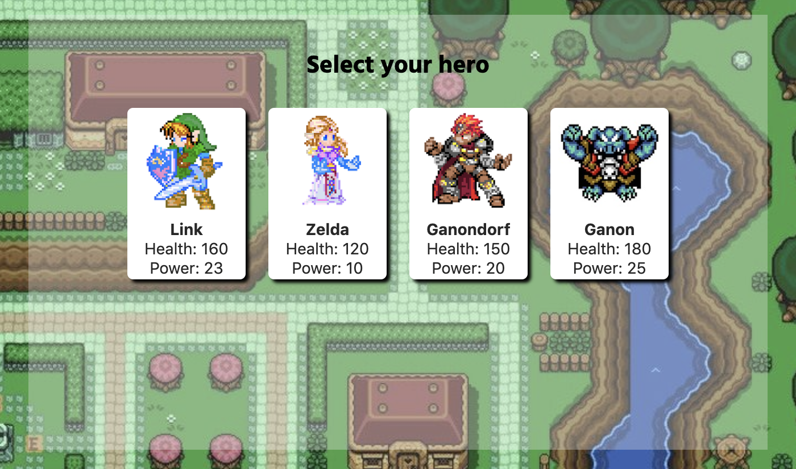
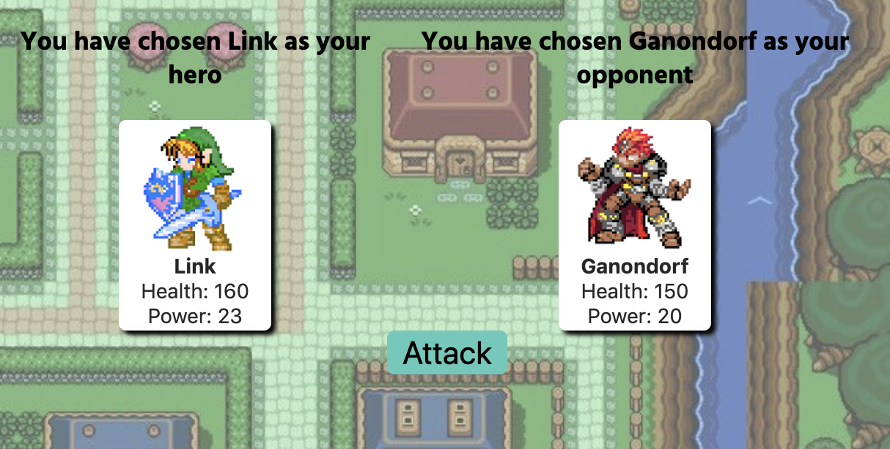

# Zelda and JQuery

#### A simple project created in 2017 to show and learn JQuery concepts, such as constructors, functions and on click events.

#### The goal of the game to to select two characters to fit eachother. All characters are created dynamically with constructors.

  

#### Once the characters are chosen, they attack eachother, removing health points. The first character to reach zero, loses.

  

